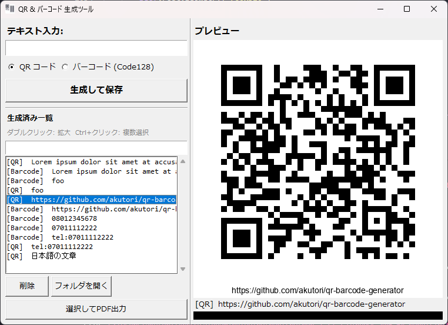

# QR & バーコード 生成ツール

テキストを入力して QR コードまたはバーコード (Code128) を生成・保存する Windows 向け GUI アプリケーションです。

## スクリーンショット



## 機能

- QR コード / バーコード (Code128) の生成と PNG 保存
- 生成済みコードの一覧表示（入力テキスト付き）
- プレビューのリサイズ対応（ウィンドウに追従）
- ダブルクリックで拡大表示（複数同時表示可）
- 右クリックメニューからテキストをクリップボードにコピー
- 生成フォルダをエクスプローラーで開く
- 複数選択して A4 PDF グリッドとして出力（3列×4行、1ページ最大12件）
- 単一 `.exe` として配布可能

## 使い方

### バイナリ版（配布用）

1. `dist/QR-Barcode-GUI.exe` をダウンロードして任意の場所に置く
2. ダブルクリックで起動
3. テキストを入力 → コード種別を選択 → **生成して保存**

生成した画像は `.exe` と同じフォルダの `generated/` に保存されます。

### スクリプト版（開発用）

**必要なもの:** Python 3.13+、[uv](https://docs.astral.sh/uv/)

```bash
# 依存関係のインストール
uv sync

# 起動
uv run main.py
```

## 開発

```bash
# テストの実行
uv run pytest

# アイコン生成
uv run python create_icon.py

# バイナリのビルド
uv run pyinstaller --onefile --noconsole --add-data "core.py;." --add-data "assets/icon.ico;assets" --icon assets/icon.ico --name QR-Barcode-GUI main.py
```

## プロジェクト構成

```
QR-Barcode-GUI/
├── main.py          # GUI (tkinter)
├── core.py          # 純粋関数 (生成・メタデータ管理)
├── tests/
│   └── test_core.py # ユニットテスト (37 件)
├── pyproject.toml
└── generated/       # 生成画像の保存先 (実行時に自動作成)
```

## 依存ライブラリ

| ライブラリ | 用途 |
|---|---|
| [qrcode](https://github.com/lincolnloop/python-qrcode) | QR コード生成 |
| [python-barcode](https://github.com/WhyNotHugo/python-barcode) | バーコード生成 |
| [Pillow](https://python-pillow.org/) | 画像描画・表示 |
