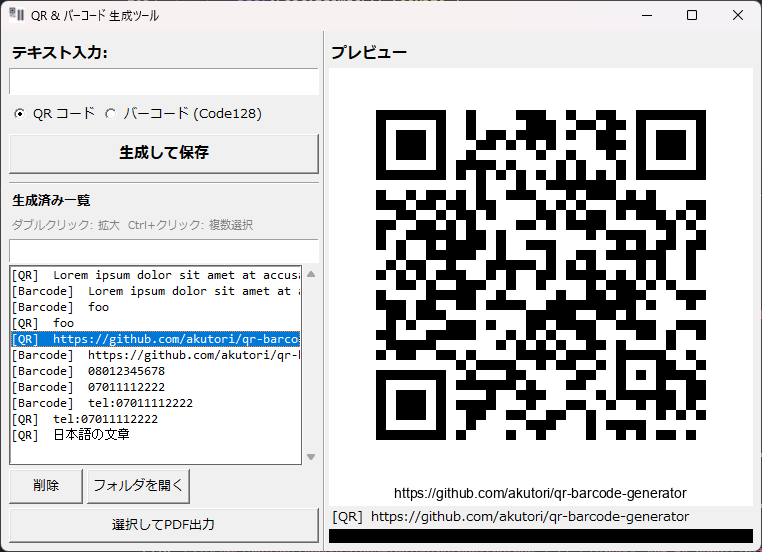

# QR & バーコード 生成ツール

<div align="center">
  
</div>


テキストを入力して QR コードまたはバーコード (Code128) を生成・保存する Windows 向け GUI アプリケーションです。

## スクリーンショット



## 機能

### コード生成

- QR コード / バーコード (Code128) を PNG 保存
- QR: 誤り訂正レベル選択（L / M / Q / H）
- QR: エンコード選択（UTF-8 / Shift-JIS）
  - Inateck BCST-72 等の業務スキャナーは QR バイト列を Shift-JIS として解釈するため、日本語 QR は SJIS 推奨
  - スマートフォンカメラなど標準的な用途は UTF-8 のまま使用可
- QR: 複数行テキスト対応（改行を含む QR コード生成可）
- Barcode: ASCII 文字のみ対応

### 生成済み一覧

- テキスト検索（入力テキスト・説明文をリアルタイムフィルタリング）
- ソート（追加日・表示名・テキスト・説明・種別 の昇降順、計 10 パターン）
- 説明フィールド（各コードに独自の説明文を付与、PDF にも反映）
- ダブルクリックで拡大表示（複数ウィンドウ同時表示可）
- 右クリック → テキスト / 画像をクリップボードにコピー
- ホバーで全テキストをツールチップ表示
- ファイル欠損時に ⚠ マーク表示

### 階層（フォルダ）

- 「階層を作成」ボタン（一覧下）またはメニュー「ファイル → 階層を作成...」で、`generated/` 直下に 1 階層までのフォルダを作成（実体は Windows のフォルダ）
  - 同名の階層（大文字小文字違いを含む）がある場合はその旨を表示
  - Windows で使えない文字・予約名・51 文字以上の名前は作成不可
- 階層の行をクリックで展開／折りたたみ（行のどこをクリックしても、連続クリックでも 1 回ごとに切り替わる。展開状態は `settings.json` に保存）
  - 階層の行には開閉マーク（▶ 閉 / ▼ 開。コードのない階層は点）が付く。ルートのコードは左端から表示し、階層内のコードだけを右にずらす
- 階層の行を右クリック →「名前を変更...」「削除...」（どちらも確認ダイアログあり）
  - 名前変更: フォルダ名と、その階層のコードの保存場所（パス）を更新。保存に失敗したときは元に戻す
  - 既存の階層と同名（大文字小文字違いを含む）にしたときは、確認のうえ中身を既存の階層へ統合する。既存のコードはそのまま残り、同じコードがあれば 1 件ずつ「上書き」/「残す」（元の階層に残す）を選ぶ（「これ以降のすべての重複に適用する」チェックで残りを一括指定できる。初期選択は統合の中止）。「残す」を選んだコードがある間は元の階層も残る
  - 削除: 空の階層は確認のうえ削除。中身がある階層は「ルートへ戻して階層を削除」（ルートに同一コードがあれば上書き/キャンセルを確認）/「コードごと削除」（画像ファイルも削除され、元に戻せない）/ キャンセル（初期選択）から選ぶ。一覧に表示されないファイルやフォルダが階層内にある場合は、何も変更せず中止する
- 右クリック → 「階層へ移動」で移動（ルートへ戻す・複数選択も可）
  - 移動先に同じコード（テキスト・種別・誤り訂正・エンコードが同一）がある場合は、上書きかキャンセルを選択（初期選択はキャンセル）。上書きすると移動先の既存コードは画像ファイルごと削除される
- 新規生成したコードは、選択中の階層行、または選択中のコードが属する階層（未選択ならルート）に保存。重複確認もその階層内で行う
- ソートは階層内で適用。検索中は該当コードのある階層を自動展開
- 階層の行を選んで「選択してPDF出力」すると、その階層のコードをすべて出力（検索中は一覧に表示されているコードのみ）。「フォルダを開く」は選択中の階層を開く
- `metadata.json` の `path` が `generated/` の外や 2 階層以上を指している場合は不正なパスとして扱い、読み込み・削除・PDF 出力の対象にしない

### 出力

- 複数選択して A4 PDF グリッド出力（列数 1〜6 を選択可、複数ページ対応）
- CSV 一括インポート（CSV / テキストファイルから複数コードをまとめて生成）
  - `type` 列に `QR` または `Q`（QR コード）、`BARCODE` または `B`（バーコード）を指定（大文字小文字不問）
  - `error_correction` 列に `L` / `M` / `Q` / `H` を指定（省略時は `M`、バーコード時は無視）
  - `encoding` 列に `UTF-8` または `SJIS` を指定（省略時は `UTF-8`、バーコード時は無視）
  - ファイルは UTF-8（BOM 付き可）で保存する。Excel では「CSV UTF-8（コンマ区切り）」を選ぶ（「CSV（コンマ区切り）」は Shift-JIS で保存され、日本語が文字化けする）
  - `folder` 列に取り込み先の階層名を指定（省略・空欄はルート）。`encoding` 列と `folder` 列は列名で読み取るため、5 列目以降のどちらも省略でき、並び順も問わない
  - 取り込み前の検証で、重複行は「⚠」、不正な階層名・存在しない階層（下記で「エラーにする」を選んだ場合）は「❌」と表示される
  - 「重複時」は スキップ（初期値）/ 上書き / そのまま追加 から選択。重複は行ごとの取り込み先の階層内だけで判定し、「上書き」も同じ階層内の既存コードだけを（画像ファイルごと）置き換える。CSV 内で重複する行は、後の行が先の行を置き換える。新しいコードを作れなかった行では、既存コードは置き換えない
  - 「存在しない階層」は 自動作成（初期値。プレビューに「（新規）」と表示）/ エラーにする（厳密に取り込みたい場合）から選択
- PDF 出力後に自動でファイルを開くオプション

### その他

- 単一 `.exe` として配布可能（インストール不要）
- ポータブル設計（生成画像・履歴・設定がすべて `generated/` 以下に集約）

## 使い方

### バイナリ版（配布用）

1. [GitHub Releases](https://github.com/akutori/qr-barcode-generator/releases/latest) から `QR-Barcode-GUI.exe` をダウンロードして任意の場所に置く
2. ダブルクリックで起動
3. テキストを入力 → コード種別を選択 → **生成して保存**

生成した画像は `.exe` と同じフォルダの `generated/` に保存されます。

### スクリプト版（開発用）

**必要なもの:** Python 3.13+、[uv](https://docs.astral.sh/uv/)

```bash
# 依存関係のインストール
uv sync

# 起動
uv run main.py
```

## 開発

```bash
# テストの実行
uv run pytest

# アイコン生成
uv run python create_icon.py

# バイナリのビルド
uv run pyinstaller --onefile --noconsole --add-data "core.py;." --add-data "assets/icon.ico;assets" --add-data "pyproject.toml;." --icon assets/icon.ico --name QR-Barcode-GUI main.py
```

## プロジェクト構成

```
QR-Barcode-GUI/
├── main.py          # エントリポイント
├── app.py           # GUI (tkinter)
├── core.py          # メタデータ I/O・画像ユーティリティ・ラベル処理
├── generators.py    # QR・バーコード・PDF 生成ロジック
├── csv_import.py    # CSV パース・バリデーション
├── tests/
│   ├── test_app.py
│   ├── test_core.py
│   ├── test_csv_import.py
│   └── test_generators.py
├── pyproject.toml
└── generated/       # 生成画像・設定・履歴の保存先（実行時に自動作成）
```

## 依存ライブラリ

| ライブラリ | 用途 |
|---|---|
| [segno](https://github.com/heuer/segno) | QR コード生成 |
| [python-barcode](https://github.com/WhyNotHugo/python-barcode) | バーコード生成 |
| [Pillow](https://python-pillow.org/) | 画像描画・表示・PDF 出力 |
